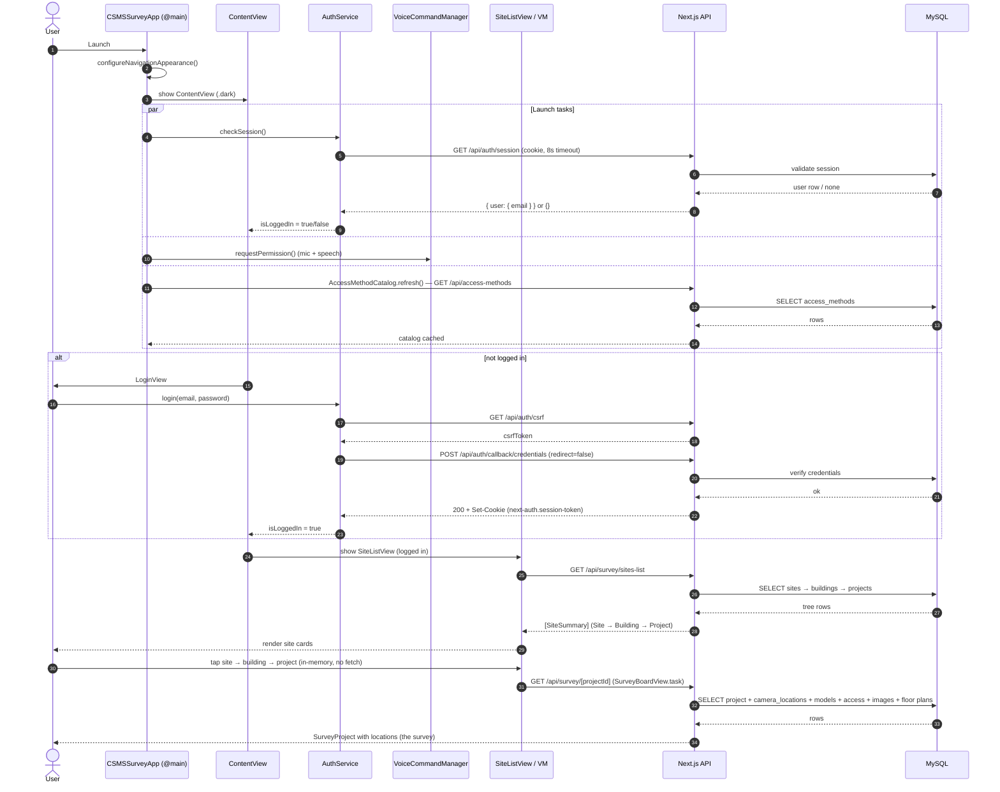

# CSMSSurvey — App Launch Workflow

How the iOS app behaves from cold launch through the first screen of data.
Traced from the actual code (`App/CSMSSurveyApp.swift`, `Services/AuthService.swift`,
`App/AppEnvironment.swift`, `Views/Survey/SiteListView.swift`,
`ViewModels/SiteListViewModel.swift`).

## Narrative

1. **App boots.** `CSMSSurveyApp` (`@main`) creates two long-lived state objects —
   `AuthService` and `VoiceCommandManager.shared` — and applies the dark
   teal/cream nav-bar theme via `configureNavigationAppearance()`. It shows
   `ContentView`, forced to `.preferredColorScheme(.dark)`.

2. **Launch tasks fire** (the root `.task`), concurrently:
   - `auth.checkSession()` — GET `/api/auth/session` (8s timeout). If the shared
     `URLSession` still holds a valid NextAuth cookie, the response carries
     `user.email` and `isLoggedIn` flips to `true`.
   - `voice.requestPermission()` — mic + speech-recognition permission.
   - `AccessMethodCatalog.shared.refresh()` — pre-fetch the access-methods
     catalog so access-control projects render their picker offline.

3. **ContentView branches on auth.**
   - Not logged in → `LoginView`. NextAuth two-step: GET `/api/auth/csrf`, then
     form-POST credentials to `/api/auth/callback/credentials` with
     `redirect=false`. Success is confirmed by the presence of a `next-auth`
     session cookie (stored in `HTTPCookieStorage.shared`, which is what makes
     step 2's restore work on later launches).
   - Logged in → `SiteListView`.

4. **SiteListView loads the tree.** Its `.task` calls `vm.load()` →
   `GET /api/survey/sites-list`, which returns the whole
   **Site → Building → Project** tree in one call. Loading / error+Retry /
   pull-to-refresh states are handled.

5. **Navigation stays in-memory until the board.** Site tap → `BuildingListView`
   (no fetch) → `ProjectListView` (no fetch) → `SurveyBoardView`, whose `.task`
   makes the only other read, `GET /api/survey/[projectId]`, loading that
   project's locations — i.e. its survey.

Cold launch with a saved session: **boot → restore session + permissions →
SiteListView → one `sites-list` fetch → idle until a project is tapped.**
Without a session it stops at `LoginView`.

## Sequence diagram

